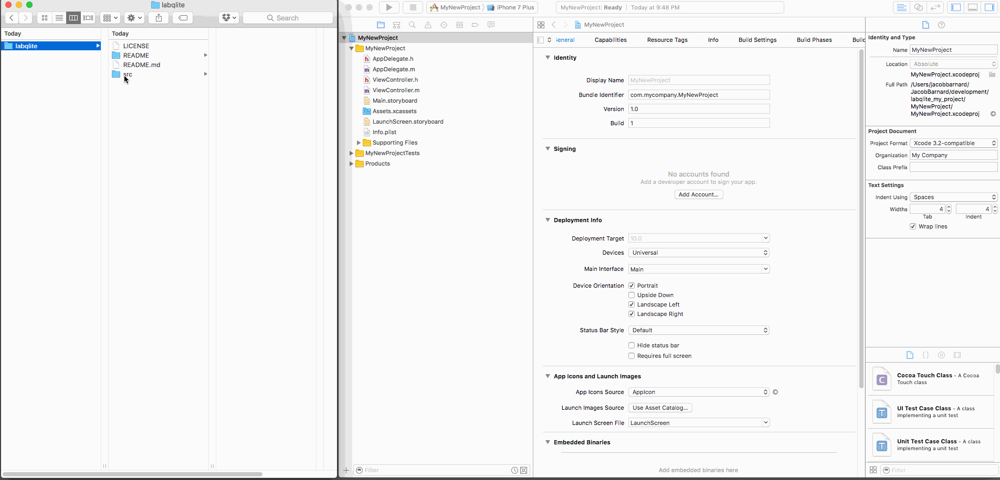
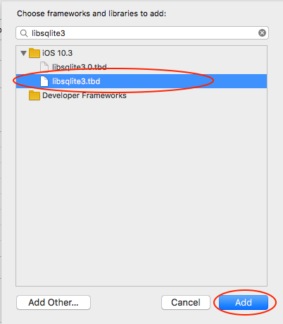
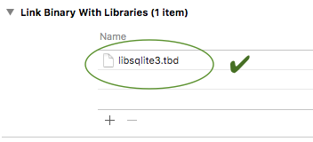
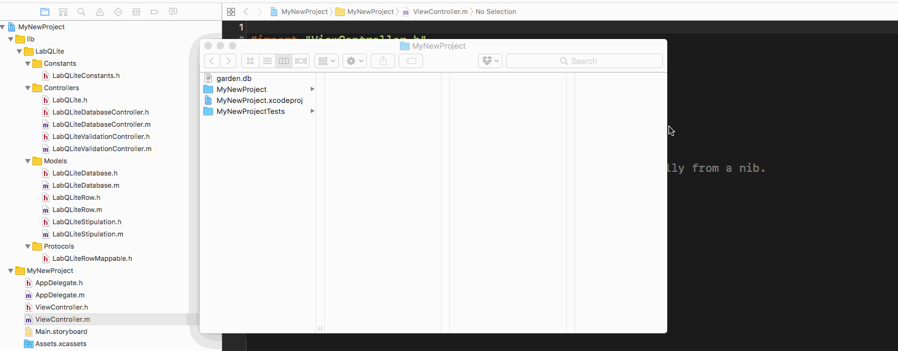
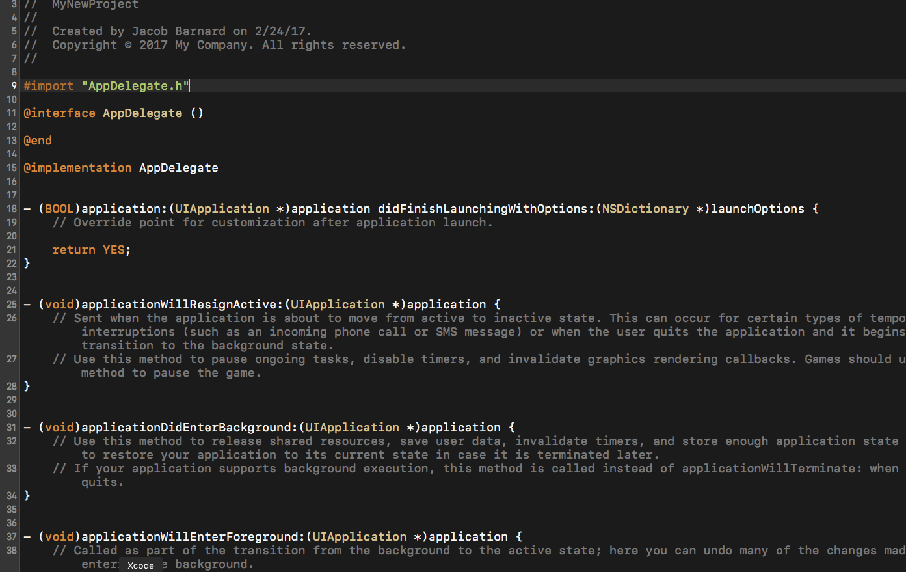

The object-oriented SQLite library for iOS that **eliminates low- *and* mid-level boilerplate**.

## What is it?
Unlike basic wrappers around SQLite, *LabQLite* takes care of both low- *and* mid-level boilerplate code, getting you right on up to the OO level from the start!

## How To?
#### 1. Ensure you have the ingredients.
- a valid SQLite 3 database file (built using SQLite 3.14.0... but earlier versions of SQLite 3 will probably work as well)
- Xcode 7 or later
- an iOS app (building for iOS 9 or later)
- an installation of GNU bash 3.2.57 (or thereabouts...) if you want to use the [model generator](https://github.com/jmbarnardgh/labqlite_model_generator)

#### 2. Add LabQLite files to your project.
LabQLite files:
  - `LabQLite.h`
  - `LabQLiteRow.h` and `LabQLiteRow.m`
  - `LabQLiteStipulation.h` and ``LabQLiteStipulation.m`
  - `LabQLiteDatabase.h` and `LabQLiteDatabase.m`
  - `LabQLiteDatabaseController.h` and `LabQLiteDatabaseController.m`
  - `LabQLiteValidationController.h` and `LabQLiteValidationController.m`
  - `LabQLiteConstants.h`
  - `LabQLiteRowMappable.h`



#### 3. Link Binary with Libraries to `libsqlite3.tbd`

<kbd>

</kbd>

<kbd>

</kbd>

<kbd>

</kbd>

#### 3. Add your SQLite 3 database file to your iOS app.
Drag-n-drop your SQLite 3 database file into your Xcode project.


#### 4. Write basic setup code.


```objective-c
#import "LabQLite.h"
```

```objective-c
NSError *error;
[LabQLiteDatabaseController activateSharedControllerWithFileFromLocalBundle:@"my_sqlite_3_database.sqlite3" toBeCopiedToAndUsedFromDirectory:@"" assumingNSDocumentDirectoryAsRootPath:YES overwrite:NO error:&error];
```

#### 5. Generate model classes from your SQLite 3 database file.
Visit the [model generator repository](https://github.com/jmbarnardgh/labqlite_model_generator) and follow the `README` in order to generate class files from the tables and views within your valid SQLite 3 database file.

#### 6. Drop your class files into your project.
Drag-n-drop your generated model classes into your Xcode project.

#### 7. Take command of your models!

## To recap...

1. Generate model classes by using [LabQLite Model Generator](https://github.com/jmbarnardgh/labqlite_model_generator) to analyze a valid SQLite 3 database.
1. *Drag-n-drop* the generated model class files into your Xcode project.
1. *Drag-n-drop* your SQLite 3 database into your Xcode project.
1. Add the LabQLite source to the Xcode project (there are various ways to do this).
1. Write basic setup code to connect to your SQLite 3 database via LabQLite.

For smaller database models, the above process takes about 10 to 20 minutes.

That's it! Now you can command your tables and views by means of handy classes, CRUD control included for free!

## Features

### Full CRUD capabilities for generated model classes; no CRUD implementation messiness in your generated model class files.
To keep *your* code base as DRY as possible, LabQLite's cousin repository ([LabQLite Model Generator](https://github.com/jmbarnardgh/labqlite_model_generator)) spits out classes that:
  - are compatible with the LabQLite library
  - inherit all of their basic CRUD powers from the `LabQLiteRow` superclass; "no assembly required"

### Block-based method counterparts for CRUD methods.
Nearly every CRUD method for your generated model classes has a block-based counterpart.

##### Example:
```objective-c
- (BOOL)insertSelf:(NSError **)error;
```

has counterpart method

```objective-c
- (void)insertSelfWithCompletionBlock:(void(^)(BOOL success, NSError *error))completion;
```

### Robust Error Handling
Every single CRUD method that your generated model classes can inherit has a double-indirection `NSError` pointer with which you can capture any low-level (at the SQLite library level) or higher-level (at the LabQLite library level) error.

Many core database-controlling/management methods within LabQLite also offer a double-indirection `NSError` pointer parameter.

Several classes within LabQLite posses their own error domains:
##### Examples:
  - `LabQLiteRowErrorDomain`
  - `LabQLiteStipulationErrorDomain`

### Hackable Model Superclass
Unlike generated model classes associated with other secondary storage frameworks, LabQLite's `LabQLiteRow` superclass is *touchable* - i.e. it is not hidden from the end-user (that would be you, the developer!) Hurray! So, if you wanted to do that oh so fantastic hack to optimize... well... whatever you want to optimize, the generic model superclass (and the protocol to which it conforms for that matter) are totally within your grasp to bend to your will.

### No placeholder instances... unless you want that kind of thing.
Some secondary storage frameworks for mobile device application software involve the concept of 'placeholder objects.' The idea is that memory is precious on mobile devices; so, keep "stuff" out of the model instance objects until you *really, really, really* need it.

Some praise this idea. Others loath it for all the collateral that such automatic memory "safeguards" imply.

LabQLite provides no such hackery. Is this a bug or a feature? It depends, of course. *Always* loading the full dataset for an instance object (especially if representing a hefty row in the database) can be risky. But then again, if memory is already low on the mobile device, and one calls up a huge instance object (e.g. to display a book's worth of text), the "assist" of 'hollowing out an object' is moot, since the imminent task is displaying a huge amount of string data that will inevitably lead to overuse of memory.

Thus, if you wish for the assist known as 'placeholder objects' (or whatever synonym it may go by) to bedeck LabQLite, such will be an exercise left to the reader.

### Active Record Pattern
There are some bits smoothed over, cut out, and so on to afford room for other features to shine, but generally speaking, LabQLite follows the Active Record pattern in terms of software architecture.

### SQLite
Last but certainly not least... if you haven't heard about one of the most popular/deployed softwares in the world, let me introduce you: SQLite is an ACID database engine that is so highly-tested, light-weight and powerful that it is used in aircraft operation! It also happens to be the database engine with which LabQLite talks.

## Technical Specifications  
LabQLite:
  - is written in Objective-C
  - is designed for integration with iOS app source code
  - is designed with Xcode compatibility in mind
  - relies on the `Foundation` framework 
  - relies heavily on `NSObject` and `NSCollection` subclasses
  - communicates with SQLite 3 library
  - has just over 3500 lines of code 
  - has a source code footprint of about 190 KB

## Testing
LabQLite has exactly 100 unit tests backing it at this point. A mild start, but every major player within the library has tests for it, and some have several scenarios covered. Tests will continue to be developed as opportunities and/or needs arise.


## Back-story
Having used SQLite 3 to build iOS apps in the past, I found it extremely painful to write boilerplate code. Even if able to bypass the initial boilerplate (perhaps with a simple wrapper or some code snippets), I still had to write what I call the "mid-level boilerplate" (writing model classes, database manager class, proxies, etc.) which takes just as long if not longer. LabQLite at its core is a mitigation against the aforementioned inconveniences.

## FAQ
  - **Why is LabQLite written in Objective-C?**
      + compiles faster than Swift in most cases
      + easier to maintain API code between LabQLite and SQLite
      + many great iOS projects still thrive on Objective-C
      + the LabQLite project was started years ago
      + nothing compelling has prompted a rewrite in another language at this point
  - **Can I use LabQLite in my Swift-based Xcode project for my iOS app?**
      + Yes! In fact, as of this writing, CocoaPods has a slick way to allow you to import Objective-C libraries so that they feel like Swift frameworks. You could go that route. Or, you could write your own interop code.
  - **What are some benchmarks for LabQLite?**
      + At this point, no benchmarking has been done, but keep in mind two things:
          * LabQLite tries to let SQLite shine through as much as possible while still providing developers with an OO feel when coding their models.
          * The most complex non-LabQLite, non-SQLite objects that LabQLite uses are `NSObject` and some subclasses of `NSCollection`.
      + To state this non-answer in other words: ideally, LabQLite strives to be as efficient as the combination of:
          * the efficiency of the `NSCollection` subclasses it utilizes
          * the efficiency of SQLite

## Leveraging LabQLite
Given LabQLite's super-fast integration time (especially with that handy LabQLite Model Generator), here might be some ways you leverage LabQLite:
  - copy and drop-in a SQLite 3 database file from an existing website that already uses a SQLite 3 database
  - export a SQLite 3 database file from another DBMS and drop it into your project
  - use your amazing SQL skills to create your own SQLite 3 database and bypass the extra time/effort of having to learn/implement another secondary storage system
  - call up that professional SQL programmer you know and have them do the heavy lifting of model design/creation

However you use LabQLite, please use it according to the words of the author of SQLite (actually, those are written at the top of the source code files for SQLite):

  > "May you do good and not evil."
  > 
  > Dr. Richard Hipp, creator of SQLite

## Licensing


**LabQLite** is in the Public Domain. See the `LICENSE` file in the root directory of this repository.

#### A note about licensing and SQLite:
SQLite is also in the Public Domain.

